# Звіт до роботи
## Тема: Основи програмування на Python
### Мета роботи: Навчитись застосовувати основні конструкції мови Python, виконати всі приклади та з використанням AI створити власні приклади які демонструють особливості кодових конструкцій Pyhton

---
### Виконання роботи
* Результати виконання завдання №1;
    1. Розробили/Створили ...
        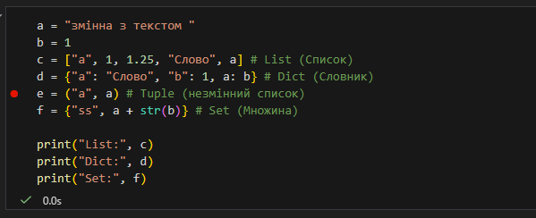
    2. Програма вивела значення ...
        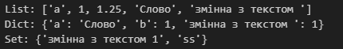
    
* Результати виконання завдання №2;
    1. Розробили/Створили ...
        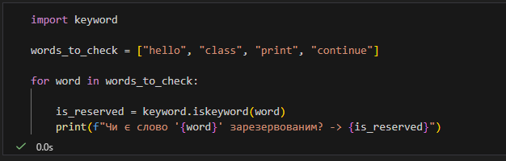
    2. Програма вивела значення ...
        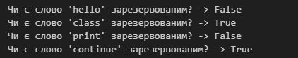

* Результати виконання завдання №3;
    1. Розробили/Створили ...
        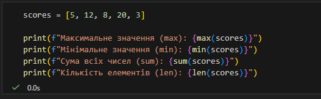
    2. Програма вивела значення ...
        
        

* Результати виконання завдання №4;
    1. Розробили/Створили ...
        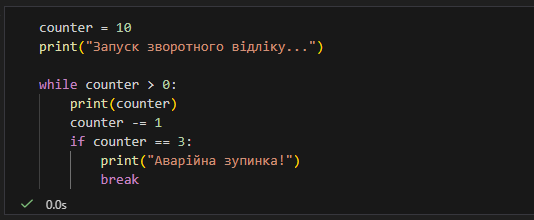
    2. Програма вивела значення ...
        

* Результати виконання завдання №5;
    1. Розробили/Створили ...
        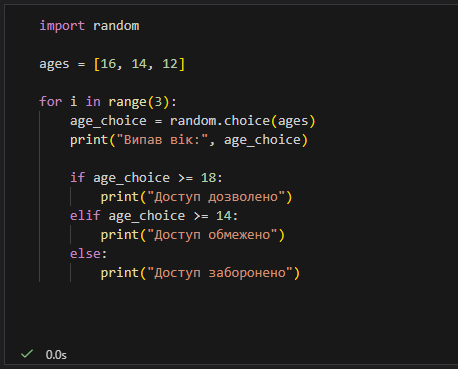
    2. Програма вивела значення ...
        
        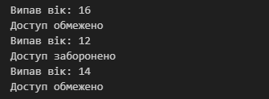

* Результати виконання завдання №6;
    1. Розробили/Створили ...
        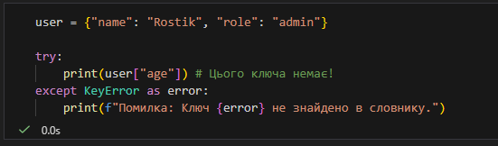
    2. Програма вивела значення ...
    
        

* Результати виконання завдання №7;
    1. Розробили/Створили ...
        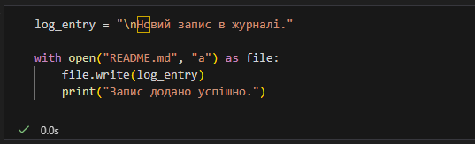
    2. Програма вивела значення ...

        

* Результати виконання завдання №8;
    1. Розробили/Створили ...
        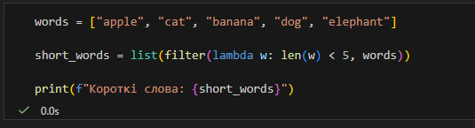
    2. Програма вивела значення ...
        
        

    

### Результати виконання індивідуального завдання (якщо такі є):
    Вступ до Python у Jupyter Notebook (згенеровано AI):

Python — це інтерпретована мова з динамічною типізацією, що робить її ідеальною для швидкого написання коду. При роботі в Jupyter Notebook (файли .ipynb) ми використовуємо концепцію інтерактивних обчислень:

Клітинки (Cells): Код розбитий на блоки. Можна запустити одну клітинку, виправити помилку і запустити її знову, не перезавантажуючи всю програму.

Kernel (Ядро): Це процес, що виконує код у фоновому режимі. Він зберігає стан змінних між запуском різних клітинок.

Магія (Magic Commands): Jupyter підтримує команди типу %timeit (вимірювання швидкості) або !ls (команди терміналу), які не є частиною стандартного Python, але полегшують роботу аналітика.

---
### Висновок:

- ❓ Що зроблено в роботі;

    Опрацьовано типи даних, цикли, розгалуження, обробку помилок (try-except), роботу з файлами та lambda-функції.
- ❓ Чи досягнуто мети роботи;
    
    Досягнута. Я навчився застосовувати базові конструкції Python на практиці.
- ❓ Які нові знання отримано;
    
    Зрозумів роботу контекст-менеджера with, відмінність списків від множин (видалення дублікатів) та принцип роботи анонімних функцій.

- ❓ Чи вдалось відповісти на всі питання задані в ході роботи;

    Так.
- ❓ Чи вдалося виконати всі завдання;

    Так.
- ❓ Чи виникли складності у виконанні завдання;

    Виникла помилка з розумінням контекст-менеджер with, але з домомогою ШІ проблему було вирішено.
- ❓ Чи подобається такий формат здачі роботи (Feedback);

    Формат зручний і підходящий для завдань
- ❓ Побажання для покращення (Suggestions);

    Немає.

