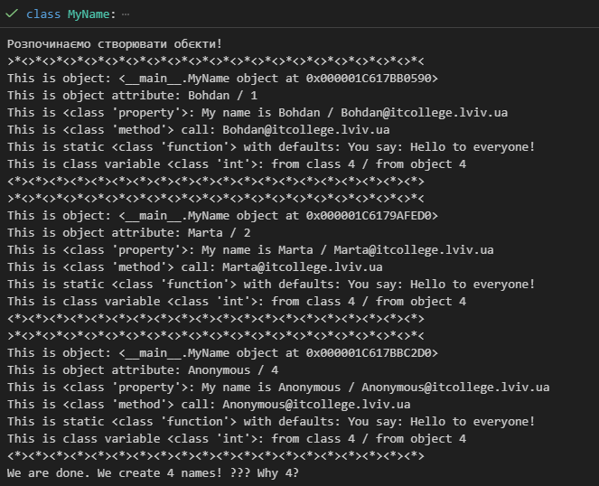
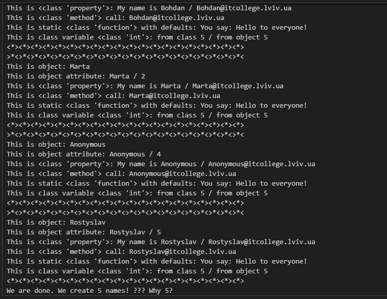
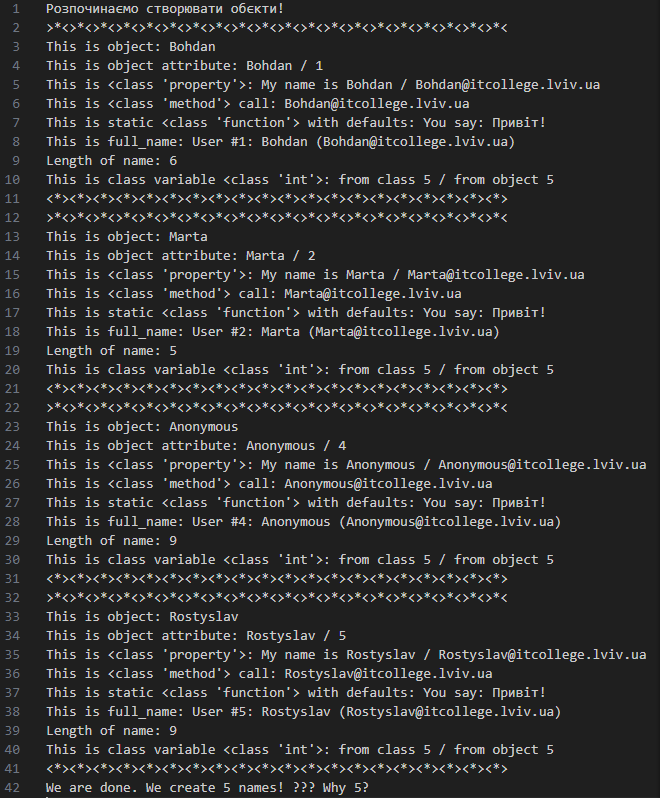

# Звіт до роботи
## Тема: Знайомство з ООП_
### Мета роботи: Навчитись використовувати основні принципи ООП, розглянути кострукції побудови класу та створення обєктів та навчитись працювати з ними

---
### Виконання роботи
* Результати виконання завдання №1;
1. Розробили/Створили:
```python
class MyName:
    """Опис класу / Документація
    """
    total_names = 0 #Class Variable

    def __init__(self, name=None) -> None:
        """Ініціалізація класу
        """
        self.name = name if name is not None else self.anonymous_user().name #Class attributes / Instance variables
        MyName.total_names += 1 #modify class variable
        self.my_id = self.total_names

    @property
    def whoami(self) -> str: 
        """Class property
        return: повертаємо імя 
        """
        return f"My name is {self.name}"
    
    @property
    def my_email(self) -> str:
        """Class property
        return: повертаємо емейл
        """
        return self.create_email()
    
    def create_email(self) -> str:
        """Instance method
        """
        return f"{self.name}@itcollege.lviv.ua"

    @classmethod
    def anonymous_user(cls):
        """Classs method
        """
        return cls("Anonymous")
    
    @staticmethod
    def say_hello(message="Hello to everyone!") -> str:
        """Static method
        """
        return f"You say: {message}"


print("Розпочинаємо створювати обєкти!")

names = ("Bohdan", "Marta", None)
all_names = {name: MyName(name) for name in names}

for name, me in all_names.items():
    print(f"""{">*<"*20}
This is object: {me} 
This is object attribute: {me.name} / {me.my_id}
This is {type(MyName.whoami)}: {me.whoami} / {me.my_email}
This is {type(me.create_email)} call: {me.create_email()}
This is static {type(MyName.say_hello)} with defaults: {me.say_hello()} 
This is class variable {type(MyName.total_names)}: from class {MyName.total_names} / from object {me.total_names}
{"<*>"*20}""")

print(f"We are done. We create {me.total_names} names! ??? Why {MyName.total_names}?")
```


2. Програма вивела значення ...
   


* Результати виконання завдання №2;
1. Розробили/Створили:
```python
class MyName:
    """Опис класу / Документація
    """
    total_names = 0 #Class Variable

    def __init__(self, name=None) -> None:
        """Ініціалізація класу
        """
        self.name = name if name is not None else self.anonymous_user().name #Class attributes / Instance variables
        MyName.total_names += 1 #modify class variable
        self.my_id = self.total_names

    def __str__(self) -> str:
        return self.name

    def __repr__(self) -> str:
        return f"MyName(name='{self.name}')"

    @property
    def whoami(self) -> str: 
        """Class property
        return: повертаємо імя 
        """
        return f"My name is {self.name}"
    
    @property
    def my_email(self) -> str:
        """Class property
        return: повертаємо емейл
        """
        return self.create_email()
    
    def create_email(self) -> str:
        """Instance method
        """
        return f"{self.name}@itcollege.lviv.ua"

    @classmethod
    def anonymous_user(cls):
        """Classs method
        """
        return cls("Anonymous")
    
    @staticmethod
    def say_hello(message="Hello to everyone!") -> str:
        """Static method
        """
        return f"You say: {message}"


print("Розпочинаємо створювати обєкти!")


names = ("Bohdan", "Marta", None, "Rostyslav")
all_names = {name: MyName(name) for name in names}

for name, me in all_names.items():
    print(f"""{">*<"*20}
This is object: {me} 
This is object attribute: {me.name} / {me.my_id}
This is {type(MyName.whoami)}: {me.whoami} / {me.my_email}
This is {type(me.create_email)} call: {me.create_email()}
This is static {type(MyName.say_hello)} with defaults: {me.say_hello()} 
This is class variable {type(MyName.total_names)}: from class {MyName.total_names} / from object {me.total_names}
{"<*>"*20}""")

print(f"We are done. We create {me.total_names} names! ??? Why {MyName.total_names}?")
```

2. Програма вивела значення ...
   



* Результати виконання індивідуального завдання (якщо такі є):

    ❓ Чому коли передаємо значення `None` створюється обєкт з іменем `Anonymous`?

    Якщо name немає (None), програма створює тимчасовий об'єкт з менем "Anonymous" і повертає його.
    
    ❓ Як змінити текст привітання при виклику методу `say_hello()`? Допишіть цю частину коду?

    Потрібно змінити значення message.

* Результати виконання індивідуального завдання :
1. Розробили/Створили:
    
```python
class MyName:
    """Опис класу / Документація
    """
    total_names = 0 #Class Variable

    def __init__(self, name=None) -> None:
        """Ініціалізація класу
        """
        if name is not None:
            if not name.isalpha():
                raise ValueError("Ім'я може містити лише літери!")
            self.name = name.capitalize()
        else:
            self.name = self.anonymous_user().name
            
        MyName.total_names += 1 #modify class variable
        self.my_id = self.total_names

    def __str__(self) -> str:
        return self.name

    @property
    def whoami(self) -> str: 
        """Class property
        return: повертаємо імя 
        """
        return f"My name is {self.name}"
    
    @property
    def my_email(self) -> str:
        """Class property
        return: повертаємо емейл
        """
        return self.create_email()
    
    #full_name
    @property
    def full_name(self) -> str:
        return f"User #{self.my_id}: {self.name} ({self.my_email})"

    #domain
    def create_email(self, domain="itcollege.lviv.ua") -> str:
        """Instance method
        """
        return f"{self.name}@{domain}"

    #Підрахунок букв
    def count_letters(self) -> int:
        return len(self.name)

    #Метод запису у файл
    def save_to_file(self, filename="users.txt"):
        with open(filename, "a", encoding="utf-8") as f:
            f.write(self.full_name + "\n")

    @classmethod
    def anonymous_user(cls):
        """Classs method
        """
        return cls("Anonymous")
    
    @staticmethod
    def say_hello(message="Hello to everyone!") -> str:
        """Static method
        """
        return f"You say: {message}"


print("Розпочинаємо створювати обєкти!")

names = ("Bohdan", "Marta", None, "Rostyslav")
all_names = {}

#Валідація
for name in names:
    try:
        all_names[name] = MyName(name)
    except ValueError as e:
        print(f"Error creating {name}: {e}")

for name, me in all_names.items():
    print(f"""{">*<"*20}
This is object: {me} 
This is object attribute: {me.name} / {me.my_id}
This is {type(MyName.whoami)}: {me.whoami} / {me.my_email}
This is {type(me.create_email)} call: {me.create_email()}
This is static {type(MyName.say_hello)} with defaults: {me.say_hello("Привіт!")} 
This is full_name: {me.full_name}
Length of name: {me.count_letters()}
This is class variable {type(MyName.total_names)}: from class {MyName.total_names} / from object {me.total_names}
{"<*>"*20}""")
    
    me.save_to_file()

print(f"We are done. We create {me.total_names} names! ??? Why {MyName.total_names}?")
```
2. Програма вивела значення ...
   
    

---
### Висновок:

- ❓ Що зроблено в роботі;

    Створено та модифіковано клас MyName (додано валідацію, запис у файл, нові методи).
- ❓ Чи досягнуто мети роботи;

    Досягнута, освоєно роботу з класами, об'єктами та методами в Python.
- ❓ Які нові знання отримано;

    Вивчив різницю між змінними класу та екземпляра, роботу __init__, @property та обробку помилок.
- ❓ Чи вдалось відповісти на всі питання задані в ході роботи;

    Так.
- ❓ Чи вдалося виконати всі завдання;

    Так.
- ❓ Чи виникли складності у виконанні завдання;

    Ні.
- ❓ Чи подобається такий формат здачі роботи (Feedback);

    Формат зручний для навчання.
- ❓ Побажання для покращення (Suggestions);

    Немає.

---
