# Звіт до роботи
## Тема: AI Агенти з Google ADK
### Мета роботи: Навчитись створювати AI агентів з використанням Google ADK (Python) та Poetry для управління залежностями проекту

---
### Виконання роботи
* Результати виконання завдання №1;
    1. Добавив

    ```python
    python --version
    poetry --version
    ```
    1. Програма вивела значення ...

    ```
    Python 3.13.7
    Poetry (version 2.4.1)
    ```
* Результати виконання завдання №2;
    1. Створився poetry.lock, він потрібен для фіксації точних версій усіх встановлених пакетів та їхніх внутрішніх залежностей.

* Результати виконання завдання №3;
    1. Добавив

    ```python
    poetry run adk --version
    poetry run adk --help
    ```
    1. Програма вивела значення ...

    ```python
    adk, version 2.1.0

    api_server   Starts a FastAPI server for agents.
    conformance  Conformance testing tools for ADK.
    create       Creates a new app in the current folder with prepopulated agent template.
    deploy       Deploys agent to hosted environments.
    eval         Evaluates an agent given the eval sets.
    eval_set     Manage Eval Sets.
    migrate      ADK migration commands.
    optimize     Optimizes the root agent instructions using the GEPA optimizer.
    run          Runs an agent.
    test         Runs pytest on agent test JSON files under the specified folder.
    web          Starts a FastAPI server with Web UI for agents.
    ```
* Результати виконання завдання №4;
    1. Створили agent.py і скопіювали туди код
    ```python
    
    ```
    1. Програма вивела значення ...

    ```

    ```

     Результати виконання завдання №5;
    1. Запиталив агента Який зараз час у Львові, Токіо, Варшаві

    1. Агент відповів

    ```
    [time_agent]: Зараз у Львові 01:29:50.
    [time_agent]: Зараз у Токіо 01:31:15.
    [time_agent]: Зараз у Варшаві 01:31:51.
    ```


     Результати виконання завдання №6;
    1. Спитали в агента

    ```python
    Який зараз час у Парижі, Римі, Бангкоку, Стамбулі,Лондоні, Нью-Йорку, Токіо, Дубай, Сінгапурі, Амстердамі
    ```
    1. Агент відповів

    
    


     Результати виконання завдання №7;
    1. Добавив

    ```python
    "Обчисли площу прямокутника зі сторонами 5 та 10"
    "Яка площа кола з радіусом 7?"
    "Який об'єм куба з ребром 3?"
    ```
    1. Програма вивела значення ...

    


     Результати виконання завдання №8;
    1. Добавив

    ```python
    "Поясни що таке декоратори в Python"
    "Як працює list comprehension?"
    "Перевір синтаксис: print('Hello World')"
    ```
    1. Програма вивела значення ...

    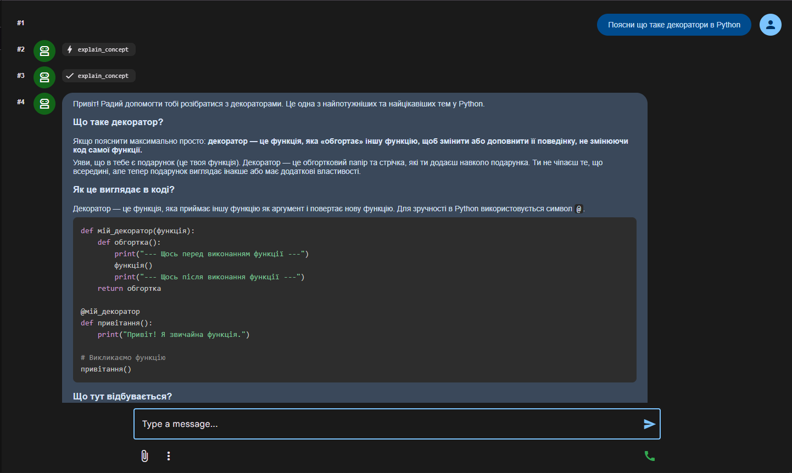  
    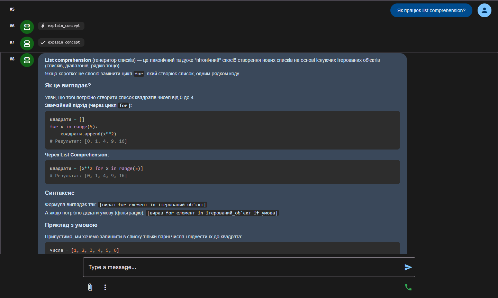
    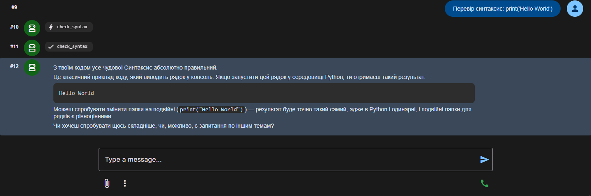

    Результати виконання завдання №9;
    1. Добавив

    ```python
    "Напиши коротку історію про подорож у космосі"
    "Створи казку про дружбу між роботом та людиною"
    ```
    1. Програма вивела значення ...

    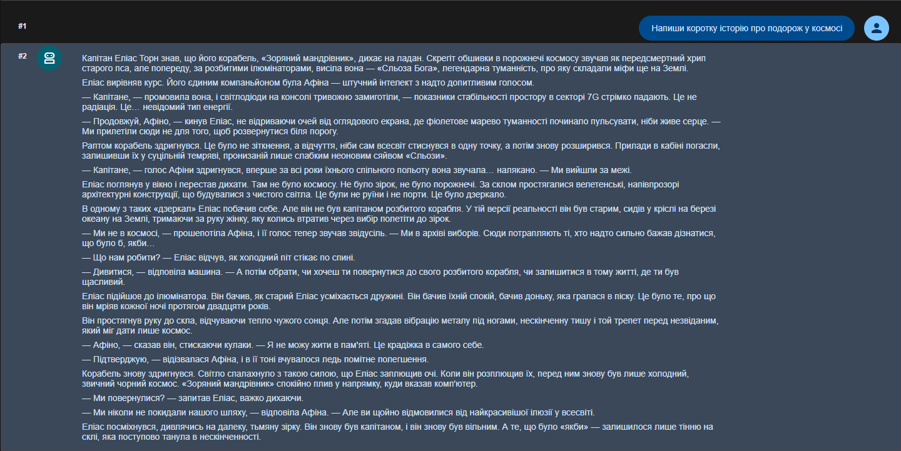
    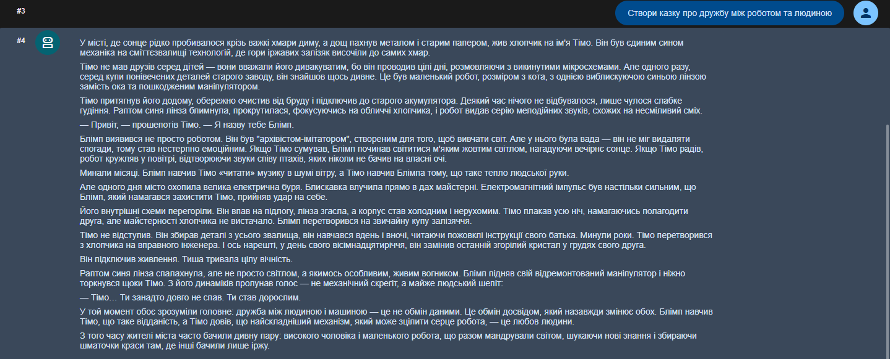

    Результати виконання завдання №10;
    1. Добавив

    ```python
    temperature=0.1
    temperature=0.7
    temperature=1.3
    ```
    1. Програма вивела значення ...
    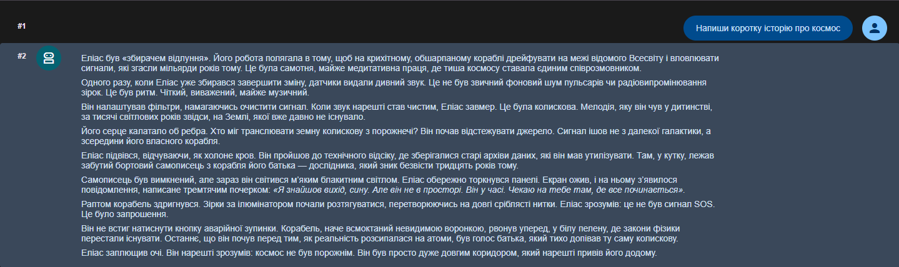
    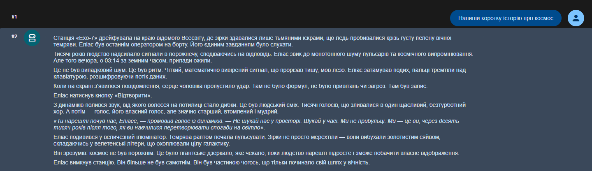
    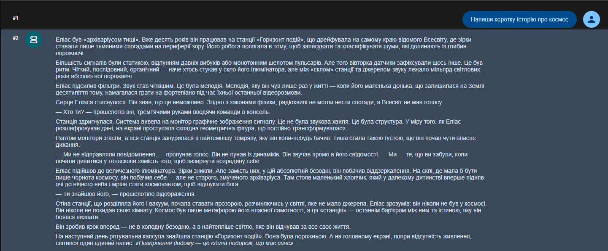
    Результати виконання завдання №11;
    1. Добавив

    ```python
    Представитеся агенту (назвіть своє імʼя)
    Розкажіть про своє хобі
    Згадайте улюблений колір
    Потім запитайте "Як мене звати?" та "Яке моє хобі?"

    ```
    1. Програма вивела значення ...
    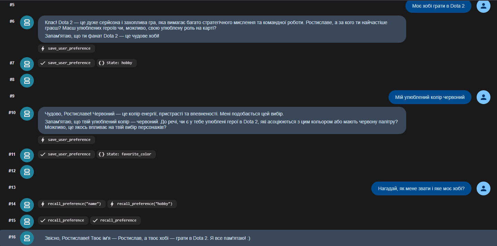

    Результати виконання завдання №12;
    1. Добавив

    ```python
    poetry run adk run my_first_agent --verbose
    ```
    1. Програма вивела значення ...
    ```python
    Usage: adk run [OPTIONS] AGENT [QUERY]
    Try 'adk run --help' for help.

    Error: No such option '--verbose'.
    ```

    Результати виконання завдання №13;
    1. Добавив

    ```python
    Робота зі структурою проекту

    ```
    1. Програма вивела значення ...
    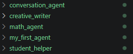

    Результати виконання завдання №14;
    1. Добавив

    ```python
    Створіть файл зі спільними інструментами та використайте їх у декількох агентах. Імпортуйте інструменти так:
    ```
    1. Програма вивела значення ...
    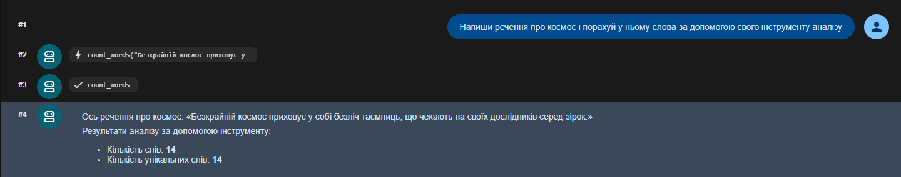

    Результати виконання завдання №15;
    1. Добавив

    ```
    Я обрав створення кулінарного агента, оскільки це дозволяє ідеально продемонструвати валідацію вводу (перевірку на нульові або від'ємні порції). Інструкції чітко визначають роль агента (шеф-кухар), його експертизу та формат відповідей. Інструмент scale_recipe містить детальну документацію (docstrings) та повертає структурований словник dict із полем error для обробки винятків, що відповідає best practices
    ```
    1. Програма вивела значення ...


    Результати виконання завдання №16;
    1. Добавив

    ```python
    Запустіть агента, розкажіть йому щось про себе, вийдіть та запустіть знову. Перевірте чи агент памʼятає попередню інформацію. Додайте скріншоти обох сесій у звіт.
    ```
    1. Програма вивела значення ...
    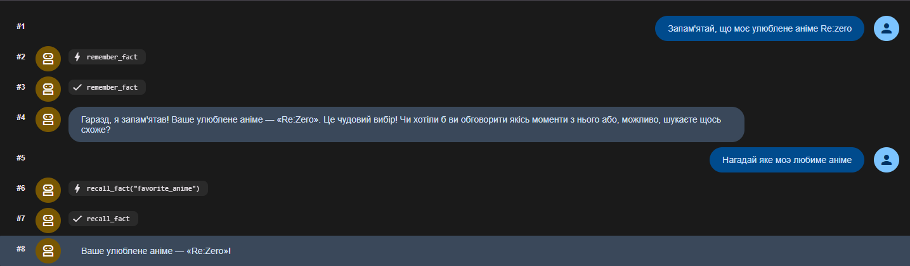


    Результати виконання завдання №17;
    1. Добавив

    ```python
    Створи функцію для обчислення факторіалу числа
    ```
    1. Програма вивела значення ...
    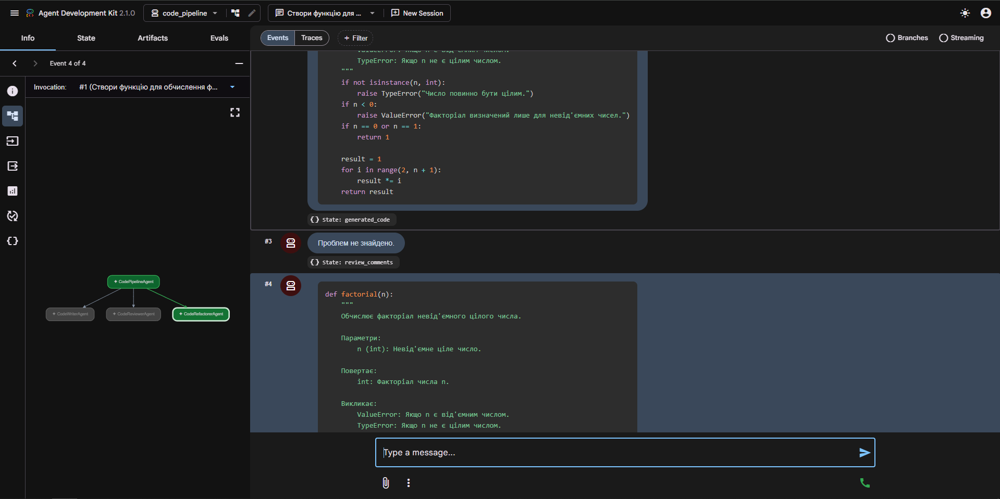


Результати виконання завдання №17;
    1. Добавив

    ```python
    Поясніть у звіті переваги Sequential агента. Чому важливий порядок виконання підагентів?
    ```
    1. Програма вивела значення ...
    ```
    Перевага Sequential агента полягає у строгому контролі над процесом. Порядок виконання критично важливий, оскільки кожен наступний крок (наприклад, рев'ю) залежить від результатів попереднього кроку (написання базового коду). Паралельне виконання тут неможливе, оскільки не можна рефакторити код, якого ще не існує.
    ```
    
    